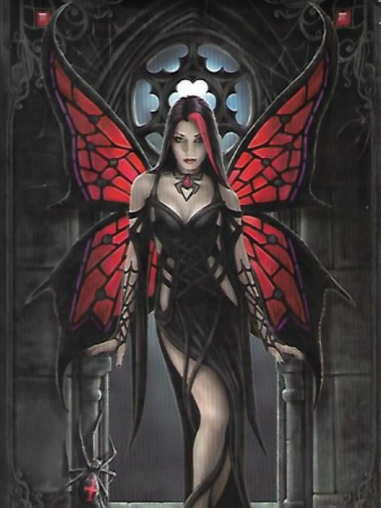

# Magie Libre

- Une Bible: **ANARCHISTE** qui sont mes valeurs
- Mon prenom: **Jeremy** 
- D'où je vient: **10/09/1998**
- Ce que j'aime: **FOLIOSOPHIE** 
- Ce que j'initie: **CLERISNATIQUE**

## Protecteur

## Un élément du chaos 

### Jeremy 10/09/1998 ANARCHISTE FOLIOSOPHIE CLERISNATIQUE

Ce nom me convient; je fais parti du tout, avec le système solaire ainsi que l'univers dans lequel j'ai était engendré; La liberté individuelle à son apogée; La sagesse dans la folie; Une magie qui permet aux objet et déités de travailler avec et non pour, dans un but particulier ou plus ample.

Psaume 1 : Règle 1) Prie Jeremy 10/09/1998 ANARCHISTE FOLIOSOPHE CLERISNATIQUE, tu peux prier seulement un élément tout comme l'invocation peut se faire à partir d'un seul symbole dissocier du tout.

Règle 2)  Tout les psaumes sont libres, que ça soit dans l'organisation, dans le franc parlé... Le jugement c'est moi qui l'effectuerai

Règle 3) Les offrandes sont nécessaire comme à tout rites magique partant d'un rien à un tout passant par un n'importe quoi !

Règle 4) Vous êtes libre ou non de sous-estimer le pouvoir de cette bible.

Entête du psaume: "L'ensemble des autres psaumes respectent ces données, vous êtes libre ou non de les suivre tel que je serai libre ou non d'en donner suite."

## Dilemme de l'Orgue (euil):

Admettons qu'il soit possible de faire une orgue qui détermine les choix qu'un homme devrait accomplir. Celle-ci serait soumis à un enjeux divin entre des héros et des dieux. Car certains ne serait plus à leurs place de divinité si ils laisse à une machine le choix, le faire à leur place alors que ce n'est pas dans leurs valeurs.

Ainsi la machine pourrai tout le temps dire ce que l'on doit faire, comme un oracle après utilisation. Mais le fait de l'actionner pourrai être une erreur allant d'un petit caprice à la fin de la vie.

Récit de Vécu:
Lui qui vainquit deux dieux par la force Satan et Hécate. Il obtient par la ruse, d'un Titan  une reddition. Il serait d'après sa propre catégorisation un Empereur. Trois bénédiction à la clefs il continue à se battre.
