# Suivre Indice Environnement

## Chamanisme Holistique

> L’altération des états de conscience ou
> Les changements d’états

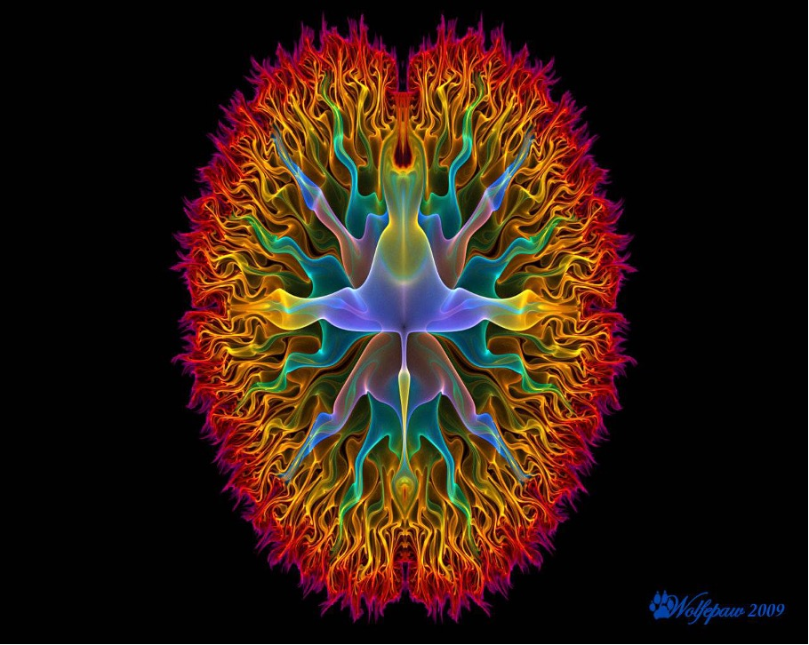

## L’Alchimie de Paulo Coelho

L'alchimie apparaît  au Moyen âge, comme  le but de transmuter des métaux. En effet certains prétendent  savoir changer le plomb en or, ou alors créer  la pierre philosophale dans le but d'être immortel. De nombreuses civilisations, comme l’Egypte gréco-romaine, la chine et même durant l'époque de la Renaissance manipulent l'alchimie. 

Seulement cette alchimie de transmutation est à différencier de l'Alchimie du cœur (alchimie qui lie deux âmes sœur et qui permet  la réalisation personnelle). Dans cette alchimie l'individu serait guidé par des signes. L'ensemble de ces signes permet de savoir que l'on progresse vers la bonne voie.  C'est une alchimie décrite par l'auteur romancier Pablo Coelho qui à obtenu une renommé  internationale avec son livre L'Alchimiste.

Ici la question traitée est de savoir observer les signes que Pablo  Coelho décrits dans son livre. Quelles pourraient être ces signes ?  Comment les percevoir parmi tout ce que l'on voit ?  Dans  quel modèle ou récurrence, l'alchimie ou les signes se manifestent t-ils ? 

On peut  imaginer plusieurs possibilités concernant l'organisation des signes. Par exemple quand Pablo Coelho nous révèle qu'il est possible de progresser vers sa quête personnelle. D'autre lieu en présence  des signes sont imaginables. Les signes nous interpellent  même lorsqu'on se déplace à un autre endroit. Admettons par exemple que nous sommes dans le système d'un échiquier, quel serait alors l'alchimie ?  

## Théorisation de l'alchimie avec les échecs

Admettons une installation comme celle d'un jeu d'échec, à l'échelle planétaire. L'alchimie du cœur serait toujours présente quelque soit la pièce que l'on est. Ce serait donc réconfortant de savoir que l'on est toujours même selon sa nature (dame, roi, fou, pion, cavalier, tour) enclin à être guidé par des signes.  Notre nature serait celle dans laquelle nous devons nous comporter dans le but de nous réaliser pleinement et ainsi atteindre notre trésor personnel selon l'ouvrage de Pablo Cohelo. Seulement le parcours est difficile, et mène à des endroits pleins d'embûches ou chacune des pièces devra composer avec les autres. Et parfois même utiliser le talent des autres pièces. 

Exemple : 
Celui du saut pour le cavalier qui est utile au pion pour le saut de la première case  devant lui. Le talent du fou qui est de manger en diagonale, ainsi que les autres qu'il pourra découvrir au fur et à mesure de son avancée. Le pion face aux difficultés changera de talen avant de se révéler accompli, pour sa promotion en pièce majeure. Les pièces dans leurs totalités, se composent ensemble avec le système. La vision alchimique des échecs, est une vision holistique qui va plus loin que des pièces qui se disputent un trône, mais s'appuie sur des courants que l'environnement capte. Ainsi les répercussions de ces courants sur ce qui nous entoure sont les signes. On peut représenter ces changements à travers un kaléidoscope. 
 
Le philosophe Schopenhauer à imaginer le kaléidoscope comme un modèle qui serait en réalité  fini. Ces changements de modèles reproduisant les mêmes éléments, comme si l'alchimie était similaire à une suite de signes reproduits dans un modèle. Alors on peut imaginer la fin du modèle. Pour y parvenir il faut une complétude. Ce que des éléments adverses  nous permettraient d'acquérir. Ainsi selon notre progression, nous serions plus ou moins complets et  proches du développement personnel. On peut imaginer comme quelqu'un qui chercherai son Yang, qu’à certains niveaux il y a des divisions. La suite est organisée en progression (+1). Le (0)1 et 10 étant l'unité parfaite.

Exemple :
Deux: Yin et Yang: noir et blanc
Trois: couleurs primaires: Jaune, rouge, bleu
Quatre : famille de jeu: pic, trèfle, carreau, cœur
Cinq : une pyramide
Six : Symbole dans la nature: ex: une fourmi: six pattes
Sept: Les traités d'Astronomie du XVe 
Huit : cases des échecs horizontales

Cet exemple  de complétude peut  expliquer la recherche de chiffres bonheur, ou la recherche de symboles. On peut voir ce qui nous oppose dans l'adversité et non dans la confrontation. Car l'alchimie peut nous envoyer tous types de signes qu'il faudra interpréter. L'interprétation ici montre bien que c 'est la personne elle même qui va percevoir, en voyant deux antennes pour la fourmi  à la place des six pattes, ou bien plus de sept références dans Les traités d'Astronomie du XVe (feuille jointe).

Une autre différence d'interprétation alchimique dans le monde visuel, par exemple dans les cartes. On peut y voir des symboles, des formes. Ici on peut observer le **carr**eau qui est le **quart** du haut, qu'on retrouve dans le pi**qu**e. Le **p**ic à aussi des cercles en forme de **p** qu'on retrouve dans le cœur. Le **tr**èfle, on peut voir le mot **tr**ois, et le mettre en lien avec le carreau et voir trois quart, ainsi on peut mettre aux embouchures trois carreaux, d'ailleurs on voit une queue de carreau qui se forme. De même au pi**qu**e.

Les éléments  de complétudes se complètent si on les perçoit de manière adéquate. Les trois couleurs primaires se complètent car on obtient l'ensemble des  couleurs, mais parfois l'utilisation de l'une d'elle ne va pas de paire avec les deux autres. Elles sont séparables. C'est la même idée pour le Ying et le Yang qui sont séparés et complémentaires, seulement quand on progresse on retrouve les éléments opposés comme le Yang dans le Yin. Ce qui permet comme avec l'alchimie de deux êtres d'avancer dans une progression.

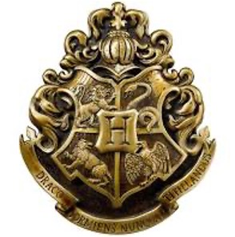

Cet avancement dans l'alchimie nous fait parfois faire des rencontres. Ces rencontres peuvent être avec l'âme sœur, ou alors des âmes amies ou alors opposés. Il se peut parfois que ce regroupement permette une entreprise commune. Comme la création d'armoirie. Dans les films et séries on peut retrouver comme dans Harry Potter des armoiries comme celle là.

Ainsi dans le cadre de cet armoirie  on peut voir des  indices et des détails qui vont influencer  Harry potter vers Griffondor , Cette influence correspond à l'alchimie telle que nous la définissons car elle permet à Harry Potter, de faire sa  quête de développement personnel. Il est tiraillé entre ce qu'il doit devenir un Griffondor et ce qu'il ne doit pas devenir un Serpentar. Cette école fondée par quatre grands sorciers,  offre une protection contre le  groupe qui est face à notre adversité. Ce qui lui permet de progresser vers son but personnel. Il y a de nombreuses références à la mort. La lecture qu'on peut en faire et celle d'un garçon qui doit surmonter la mort de ses parents et faire le deuil pour avancer. Ce qu'il faut, c'est qu'il avance vers sa réussite personnelle et l'ensemble des films vont montrer plusieurs découvertes d'objets qui vont lui permettre de ce réaliser. Comme la pierre philosophale qui permet l'immortalité et qui est produite par un Alchimiste, tout comme d'autres secrets qu'il découvrira...

Il y a d'autres films et séries qui traitent rapidement de l'alchimie, il est intéressant de voir une synthèse de l'ensemble de ces idées:

L’Alchimie (cercle jaune) tel que vu dans les séries  repose sur trois base solides : La Magie (rouge) ; La Religion (jaune); La Science (cercle bleu) qu'on peut concevoir comme ceux-ci:

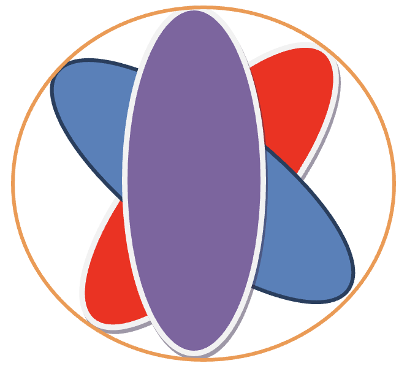

> Les personnes qui par nature 	
> suivent leurs développement	 
> personnel,  qu’elles 	
> perçoivent ou non les signes	 
> utilisent une puissance que je	 
> nomme 

> Le cœur est souvent mentionné
> comme ce qu’il faut suivre.
> Comment savoir quand
> c’est le cœur qui parle ?

## l’Alchimie

L’Alchimie est donc composée de La Magie (rouge) ; La Religion (jaune); La Science (bleue). Ces trois piliers ayants chacun leurs forces avec leurs propres disciplines ce qui ensemble fondent l'Alchimie. Lorsque l'équilibre n'est pas  atteint ou au contraire rompu, les films et séries font état de personnages malades.

Il est possible qu’en progressant dans le développement personnel (hors alchimie) la personne parviennent à des cheminements transversaux :

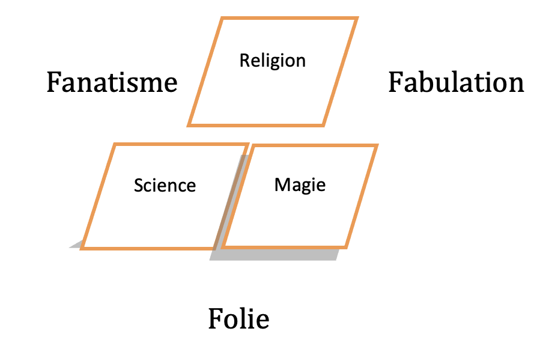

Dans ces cas l’individu ou le personnage de la série a privilégié deux piliers en oubliant de favoriser le troisième et sombre dans un milieu du non être avancé et s'éloigne de sa destinée personnelle.  L'individu par la pratique de l'alchimie va harmoniser son âme. L'alchimie ne prévoit pas un ordre universel pour les individus, ainsi chacun passera des étapes similaires différemment.  

Pour les personnes s'adonnant à cette recherche spirituelle du développement de soi, on retrouve au moyen âge les monastères qui sont ordonnés selon des principes favorisant. Journée découpée toute les sept heures (selon des chiffres bénéfiques), autre activités comme les prières (tout les jours qui est un exercice d'ouverture au sacrée). L'alchimie pouvant se développer n’ importe où, un monastère est un lieu comme l'église, qui va aider la personne qui s'égare. Alors que les fous ou les malades  commencent à être après le moyen âge, regroupés dans des endroits, qui deviendront des asiles ou l'éveil Alchimique sera plus compliqué à atteindre et à mettre en pratique.

Dans le sacré et l'alchimie pour les enfants on retrouve la série  Yu-Gi-Oh, ce sont des anciens prêtres qui détiennent le secret des parchemins. Ils  permettent l'appel des dieux égyptiens.  Pour cela il faut 7 objets du millenium :

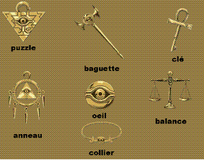

L'œil représente le savoir et chaque individu se sert d'un savoir différent dans son art. Cela date de plusieurs millénaires, il y en à sept organisés différemment par les Yu-Gi-Oh. A comprendre les Yogis, passés maître en la matière. Cette maitrise par l'objet cache une force intérieure. Qui est le dépassement  de l'objet, car c'est des organes qu'il s'agit en réalités. L'œil est pour la vue, l'anneau avec les cinq pendules représente les cinq doigts et guide,  le collier est la bonne parole basé sur le passé. Ces sept organes reliés aux chakras son sensés guider l'apprenti alchimiste, tout en indiquant notre organe et chakra du millenium. 

Une autre théorie est avancée dans la série. Il y aura trois voies possibles celle du Yogi, du magicien et de l'apôtre. Le yogi agit sur l'âme pour agir sur les sept chakras. Alors que le magicien agit sur les sept chakras pour agir sur l'âme. Quand à l'apôtre, il lutte contre les distractions intérieures et extérieures pour maintenir les sept chakras et son âme. Un Yu-Gi-Oh est un mélange des trois au sommet de l'art. On retrouve les trois piliers science, magie, religion vu précédemment avec les trois dieux Egyptiens aux aptitudes et aux couleurs primaires.

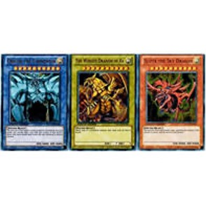

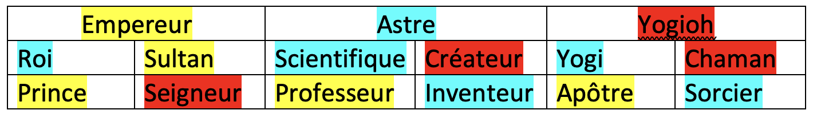

Différents chemins peuvent conduire l’individu à son développement personnel dans les dessins animés. En restant avec la Magie, la Science et la Religion plusieurs accomplissements sont possibles.  Si on s’accompli avec la Science on devient un Astre, avec la Religion un Empereur et avec la Magie un Yogioh. Pour y parvenir on peut développer différents plans qui sont de nature avec la science (bleu), la magie (rouge) ou la religion (jaune) et qui se complètent. Il faut trois grandes cérémonies dans le vécu du personnage pour vivre une ascension jusqu’à être Empereur, Astre ou Yogioh . Astre signifie pouvoir voir les régularités de la nature et intervenir pour rajouter de la stabilité ou de l’instabilité. L’Empereur  est celui qui connait son chemin de vie, ainsi que celui des autres et qui à la possibilité de les aider ou de leurs faire dévier de leurs route. Le Yogioh est un personnage qui a un immense pouvoir magique et qui peut s’en servir ou non lors de ces actions
Parmi ces différend piliers, différents modes existent : l’attaque et la défense. Chacun des trois piliers représentent une des parties d’un conatus sans cesse attaqué et sans cesse attaquant l’extérieur.

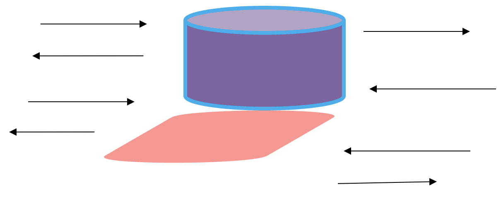

En soit l’attaque et la défense sont des interactions involontaires avec l’extérieur qui vont faire diminuer ou augmenter la puissance des trois piliers. Au niveau de développement d’un Astre, d’un Empereur et d’un Yogioh, on  peut imaginer que cela n’est plus involontaire mais devient contrôlé. Ce qui ce traduit par une concentration dans l’un des trois piliers pour concentrer ou expulser, ce qui correspond à la défense et à l’attaque.

Il faut voir l’environnement comme holistique, chaque chose en engendre d’autre ce qui forme le système. Dans les dessins animés ce sont de nouveaux systèmes qui sont proposés. Avec des personnages qui ont des caractéristiques particulières. Il en va de même avec la création de monstre dans Dragon Quest, tel un biologiste on peut les faire se mélanger pour les muter en un plus puissant ou alors dans Pokémon ou ils sont capables  d’évoluer. Cela reprend l’idée de la théorie de l’évolution  de Darwin avec des pokémons dressés qui évoluent en devenant plus puissants dans leurs environnements respectifs quand les autres moins puissants son délaissés par les dresseurs.

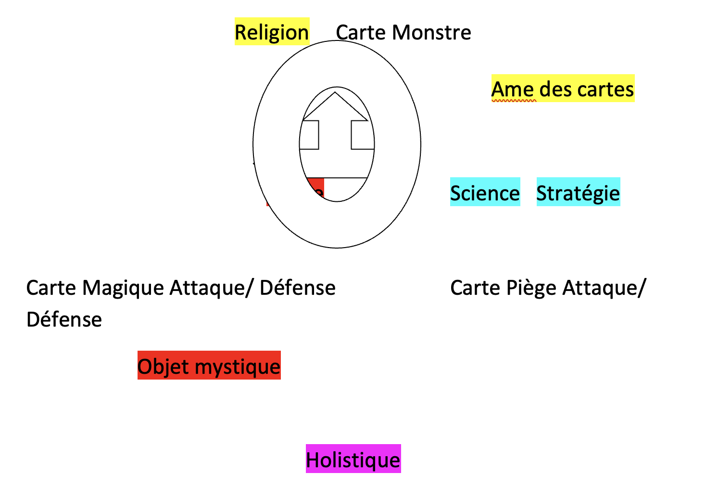

## Environnement de jeu Yogi-oh

On peut observer une division en trois de la partie du jeu Yogioh, avec de la magie et les cartes magiques, de la science avec les cartes pièges et de la religion avec les cartes monstres et leurs effets. L’holistique est l’environnement qui va donner des points bonus ou malus aux monstres et permettre l’utilisation de cartes magiques ou pièges.  Les signes peuvent amener à  l’utilisation d’objets mystiques dans la partie magie et aussi à une croyance en l’âme des cartes dans la partie religion, puis en disposant d’une bonne stratégie dans la partie de la science. Tout cela mènera le joueur à un système holistique très puissant d’après le dessin animé, c’est ce qui donnera le Yogioh, autrement dit le roi des jeux. 

Il y a aussi la théorie des Frères Elric, c'est  une autre série (dessin animé) qui explique l'Alchimie. On peut même obtenir un titre "Alchimiste d'Etat" comme grade. Dans la série le principe d'équivalence est nécessaire pour permettre des transmutations. C'est pour cette raison qu'il mélange des composants pour obtenir l'équivalence. Ce qui permet après le déploiement d'énergie l'obtention de l'objet. Un cercle d'invocation est aussi tracé, ce qui donne le pouvoir à l'alchimiste. Certains atteignent la pierre philosophale qui permet de ce passer de cercles de transmutation. Chez le philosophe « Paracelse » le principe d'équivalence est à observer dans le macro et microcosme. De même que pour lui la philosophie et l'astronomie sont deux disciplines liées. L'alchimie peut être considéré comme ce mélange et on peut donc dire: Il y a un moment pour chaque chose. 

La poursuite de l'alchimie est donc de trouver les choses en fonctions du moment, ce qui révèle leurs natures sur l'instant. La nature peut changer pour devenir bonne ou mauvaise selon la configuration actuelle.  Ainsi un ami, une plante ou un objet peuvent se révéler toxique. Paracelse parle de poison en segmentant la prédominance de tout objet qui aurait son propre Ying et Yang connecté lui aussi à sa philosophie et à l'astronomie qui forme l'alchimie.

D'autres ouvrages de lecture pour adolescent « Skeleton Creek »  dépeignent l'alchimie comme une suite de signes à trouver pour arriver au trésor caché. Ce trésor serait une métaphore du pouvoir et de la connaissance dans Kung-fu panda (un film pour adolescent). Ainsi avec ce savoir présent dans l'art visuel, il est possible de dresser une nouvelle connaissance  de termes dans le langage courant.

Il est important de voir que l'alchimie remonte avant même l'écriture. Dans c'est temps anciens ce socle de connaissance se trouvait dans la nature et il fallait faire appel à d'autres capacités cérébrale que ce que l'on possède aujourd'hui. Tout cela d’après les séries pour enfants comme YO GI OH dans l'explication des pouvoirs mystique du duel de monstres. L'environnement à évolué, nos outils et la taille de nos cerveaux aussi. Cependant l'environnement pallie à cette différence avec des signes présents dans les outils utilisés par l'homme. La triste vérité selon cette version, c'est qu'il n'y a pas d'amélioration seulement un changement de condition au profit de la philosophie ou de l'astronomie. Pour Paracelse il faut prendre en considération l'un et l'autre. Aujourd'hui comparé à la vision du savant "Alchimiste" du moyen Age  ce sont les outils et non le développement humain qui ont  primé sur l'être. Dans la vie de tout les jours on retrouve cette dualité: je veux être / mais je suis. 

Quand l'on sait qui l'on est, on progresse et on comprend des mécanismes de défense comme le verbe "se cacher". Certaines personnes se cachent dans le non être en attendant  d'être elle même cf. Harry Potter. D'autre se révèlent plus vite et on besoin pour progresser d'aider à leur façon les autres. Chacun à un talent dans lequel il excelle, pour cela il faut se connaître et le faire progresser.

Donc la connaissance repose sur des modèles qu'on préétabli intérieurement et qui nous apportent des informations personnellement. Les signent guident ou préviennent d'une action. Les signes peuvent être des astres, des étoiles, une roche, un papier, un mot... . L'alchimie serait plus ancienne que ce que l'on connaît de la magie, la science et la religion.  Car chacune de ces disciplines à besoin de parler ou d'écrire, ce qui n'est pas le cas de l'alchimie. L'alchimie vient avant la création de l'écriture et n'a pas besoins de la parole, mais de sons alentours et va influencer les pictogrammes de certaines civilisations.  

L'équilibre alchimique est tout le temps présent. Les actions pour le modifier doivent être simultanées pour garder le principe d'équivalence. Toutefois si l'on suit l'alchimie on peut y parvenir sans principe d'équivalence cf.Frères Elrik.

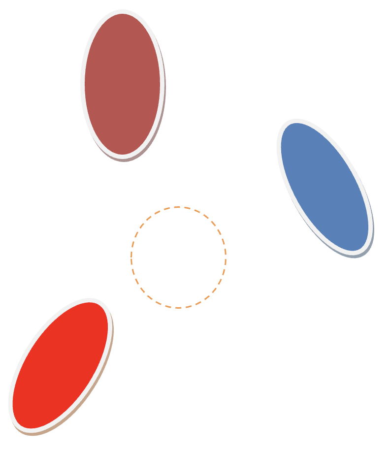

Ici on arrive à de la magie de la religion  et de la science beaucoup plus ancienne car au cœur de l'alchimie avec l'utilisation du principe de philosophie et d'astronomie de Paracelse. Contrairement à l'autre schéma le cercle est au centre, car la connaissance est tirée ex nihilo. Quand on ne sait rien, à l'état primitif on retrouve ce schéma. Qui propose une réponse au pourquoi dans cet état primitif ? On trouve de la création, des abris, des idées, des croyances, des inventions.   

On retrouve 10 cercles, 2 de magie, 2 de sciences, 2 de religions, 2 de philosophie, 2 d'astronomie. Ils sont divisés en deux partie de 5 de chaque, avec comme principe l'initiation ou non. C'est à dire le savoir à partir d'une source existante (livres, cheminements préconçues) ou alors le savoir développé par l'inné.

Dans la série Sabrina on parle aussi de 10 cercles dans l'équilibre de la terre des enfers et du ciel. Le personnage de Sabrina offre une vision des enfers différentes, avec l'ambition de les réformer. Alors acculés par les princes du déshonneur des enfers Sabrina dis : "Cette âme était indigne des enfers". Elle va même opérer des choix d'âmes qui vont y aller ou non. Cela suppose que certain son plus enclins à aller de l'un ou de l'autre coté. Et une erreur viserai à ne pas se connaître assez, et se tromper entre les enfers et le paradis. Ce serai le résultat de notre contre nature qui nous influence, parfois plus convaincante que notre nature. Dans un épisode saison deux de Sabrina, on vois deux anges se rallier aux enfers avant  de mourir damnés par les flammes des enfers, permis sans doute pour avoir renier leur dieux du paradis.  L'alchimie ici, c'est de savoir les positions que l'on doit tenir où garder et qui permet de progresser, même dans des cas comme ceux là. La philosophie et l'astronomie permettent une décision. La magie, la science et la religion de mener à bien une action. L'accord entre les cinq permet un avancement, qui sera encore plus grand si il y a les dix qui sont pris en compte, avec les facultés similaires de l'inné.

## Conclusion

Pour conclure on a vu que l'alchimie dans les supports visuels est à la fois tirée de caractéristiques innées mais peut aussi être inculquée à la suite d'un apprentissage. On retrouve la philosophie et la cosmologie, avec des penseurs comme Paracelse, ou bien on retrouve l'idée que le kaléidoscope présente un modèle qui se répète avec des éléments que l'on retrouve quel que soit le différent modèle qui vient supplanter le premier avec Schopenhauer. Ces idées permettent de montrer et d’appuyer la vision possible de ce qu’est l’alchimie. Les socles de progression comme la science la magie et la religion montre un regain d'intérêt dans les supports visuels qui laissent penser une alchimie à partir de ces trois socles. Ainsi l’Alchimie serai un mélange de ces cinq socles et capacités qui se doublerai en inné et non inné.  Ainsi l’individu devra travailler sa connaissance de soi et la pratique du soi pour parvenir à un équilibre juste est équitable.

## Perception de Jérémy 10/09/1998 -- Science d'après

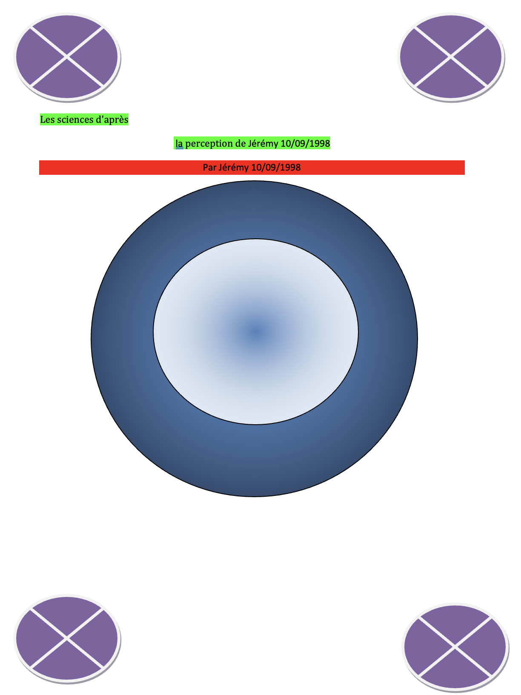

> La  science permet seulement de dessiner les contours du monde dans lequel on vit, mais c’est aussi ce que font la magie et la religion. Alors que faudrait t-il pour améliorer un peu cela, pour mieux saisir le monde qui nous entoure ? 
> 
> Une combinaison de deux disciplines est possible et voilà ce que ça  donne : 

Des personnes disposant déjà de savoir être ou faire similaire existe déjà : voilà une modélisation de ce schéma en reprenant un pole de base. Attention ici il n’est pas question de la prédominance telle qu’elle est expliquée dans mon ancien ouvrage sur les états de conscience mais belle est bien du domaine qui regroupe un autre domaine. Ici ce n’est pas la puissance de l’individu comme dans l autre ouvrage mais plutôt sa conviction qui est ici relatée.  Enfin une conviction à une puissance et une puissance sans conviction ne saurait être une puissance. Vous m’aurez compris, l’individu dans mon ancien ouvrage à un pôle prédominant ici, il en possède deux majeurs. Et cela change tout !!!

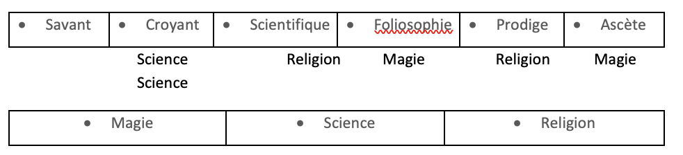

C’est une progresssion supplémentaire  , ou un devoir supplémentaire !  Les règles changent et les façons de faire et les moeurs aussi.  C’est précisément si on passé d’un empiriste à un holiste ce qui fait qu’ on reste un scientifique mais avec des idées autres, autres façons de faire et autres méthodes. 

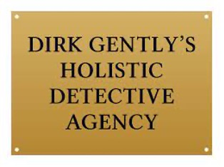

### 1)	Les déités et les affronter ou tenir tête

Le combat de tous les jours est un combat contre différents représentants d’énergie cosmique ou de déités. Parfois celles-ci se manifestent directement. Tout dépend de la personne et de ses convictions de sa façon de faire. Parfois un rien peu faire perdre énormément comme gagner beaucoup. 
Perdre/ Gagner n’est pas forcément le résultat que vous verrez à première vue. Dans tout les cas vous aurez avec le temps une amélioration de votre être intérieur, c’est la seule variable qui me parait être non négligeable et digne d’être écoutée. La mort n’est pas un échec.

Voilà comment je perçois  les choses : l’énergie que vous possédez peut être redistribuée et  une nouvelle chance peut vous être offerte. Un héros peut mourir mais un dieu ne meurt pas, car son message est assez bien ancré pour que même s’ il meurt, son message perdure. Son message étant son énergie il ne peut mourir seulement être enfermé. Il est possible aussi d’endommager le message, mais celui-ci restera du moins énergétiquement. Que les entités soient visibles ou invisibles elles agissent sur cela « l’énergie ».  Encore une fois dire qu’il ne faut pas ou qu’il faut rabâcher le même message dépends des endroits et des personnes. Chacun sa façon de faire. Donc les grecs qu’on nous présente comme des héros sont des héros car ils supportent des messages qu’ils ne tiennent pas eux même. Et la différence avec un dieu c’est qu’ un dieu peut tuer le porteur d’un message pas un héros qui tuerai seulement la personne mais pas le message. 

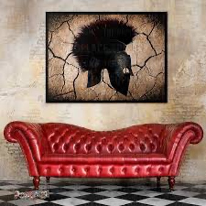

### 2)	Il est également possible de s’allier avec 

Par exemple en les plaçant comme autorité supérieure ou alors en simple alliance. Dans les combats que vous mènerez vos amis pourront devenir vos ennemis et vos ennemis des amis. Il  se peut même que l’autorité ou la déité qui vous protège vous demande même de l’aide qu’elle soit réellement dans le besoin ou alors un acte de considération. Il ne faut pas croire que le dieu est au sommet de la hiérarchie, au dessus il y a les titans et encore au dessus le chaos / La faille béante. 

### 3)	La guérison qui viendra quand elle doit venir

Le magnétiseur à un pouvoir, parfois il ne s’active pas. On peut penser qu’il y a une différence entre les énergies vibratrices et que la coincidence entre ces énergies crée le talent de magnétiseur et que même si l’individu omet d’exercer son pouvoir quelque chose se passera pour le soigner quand même si il doit être soigné (ceci inspiré d’après un modèle holistique). 

### 4)	Du point de vu de la religion celle-ci peut changer ou doit demeurer la même 

Cela dépend de l’individu et des circonstances, attention tout mauvais acte entraine des conséquences et l’inaction est un acte. 

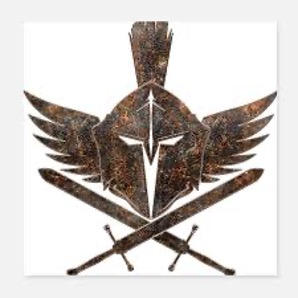

L’idée selon laquelle on naît dans un monde qui nous correspond à une période donnée est partiellement vraie et fausse. En effet on provient de différentes énergies qui nous ont procuré se qu’on va appeler un souffle vital (dénué du sens grec) qui est une énergie seulement  il n’y a pas de plan cosmique qui à décidé qu’a telle heure et tel jours un bébé du nom de Jackie Michel viendrait au monde. 

Si des énergies vous ont créés et faits, elles peuvent également vous défaire ou vous rendre différents. Je m’explique à un niveau plutôt avancé vous devrez  faire des choix entre des énergies qui sont en vous, par exemple privilégier  vos énergies plantaire à celle de vos mains, ce qui aura des impacts sur vous et vous donnera des pieds en formes de sabots ou encore différents. Entre un corps physique ou plutôt un corps qui ne serait qu’énergie. Enormément de choix s’offriront à vous.

### 5)	Modélisation

On ne peut modéliser seulement ce qui sort de la faille béante du chaos : 

C’est circulaire à l’intérieur tout ce touche et on retrouves les différentes catégorie du précédent mémoire divisé en trois science religion et magie : Puis les diffférentes catégorisations qui se divisent elles même en 7 en plus d’être 7. Ce qui donne donc 3°7°7 ou 7°3°7 ou 7°7°3 selon comment on s’y prend.  Tout ça contenu en 1 qui est la faillle béante ou le chaos.

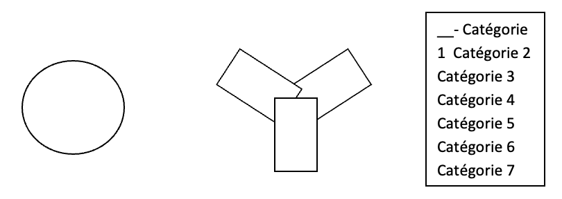

